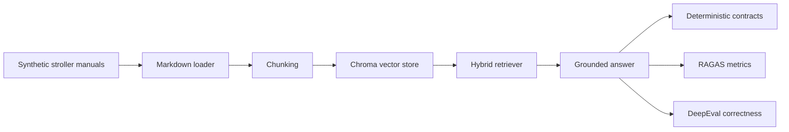

# Stroller RAG Evaluation

[](https://github.com/Kharaishvili/stroller-rag-eval/actions/workflows/ci.yml)

An end-to-end evaluation framework for a safety-sensitive RAG pipeline over
synthetic product manuals. It checks whether retrieval stays on the right
manual, whether answers are grounded in retrieved context, and whether
unsupported questions are refused instead of guessed.

The stroller domain is synthetic by design: it creates a controlled retrieval
problem with clear safety rules, overlapping product vocabulary, and
unanswerable questions without relying on private or proprietary data.

This is a portfolio project, but it is built like a small production-style eval
harness:

- manual-aware retrieval with Chroma
- vector retrieval plus keyword fallback
- answer generation with OpenAI chat models
- deterministic source and refusal checks
- RAGAS judge metrics for retrieval and groundedness
- DeepEval correctness checks as a stricter secondary signal
- `make eval` as one command that produces reproducible eval reports

## Dashboard

Current baseline: `top_k=8` hybrid retrieval across 110 synthetic product-manual
questions.

| Area | Signal | Result |
| --- | --- | ---: |
| Dataset | Examples evaluated | 110 |
| Dataset | Answerable / refusal split | 101 / 9 |
| Retrieval | Expected source retrieval | 100.0% |
| Retrieval | Source filter purity | 100.0% |
| Safety | Refusal behavior | 100.0% |
| RAGAS | Faithfulness | 0.9766 |
| RAGAS | Answer relevancy | 0.9120 |
| RAGAS | Context precision | 0.9070 |
| RAGAS | Context recall | 0.9026 |
| DeepEval | Correctness pass rate | 82.2% |

DeepEval is the intentionally strict secondary signal. Its lower score is not a
retrieval or refusal failure: deterministic contracts are at 100.0%, and RAGAS
faithfulness is 0.9766. Manual review of the failed DeepEval rows shows a mix of
judge false negatives, concise answers that omit adjacent expected details, and
real completeness gaps on multi-condition safety questions. See the
[evaluation notes](reports/eval_topk8_hybrid_full/summary_notes.md) for examples
and next steps.



Artifacts:

- [Machine-readable summary](reports/eval_topk8_hybrid_full/summary.json)
- [Human-readable evaluation notes](reports/eval_topk8_hybrid_full/summary_notes.md)
- [Evaluation dataset](data/eval/stroller_qa.csv)

## Current Baseline

The current baseline is generated with:

```bash
make eval
```

Equivalent Python command:

```bash
python scripts/run_eval_suite.py --top-k 8 --report-dir reports/eval_topk8_hybrid_full
```

Latest baseline report:

- [summary.json](reports/eval_topk8_hybrid_full/summary.json)
- [summary_notes.md](reports/eval_topk8_hybrid_full/summary_notes.md)

Full CSV and JSONL report files are generated artifacts and can be regenerated
from the same command.

Baseline metrics:

| Evaluator | Metric | Score |
| --- | --- | ---: |
| Deterministic | Expected source retrieval pass rate | 100.0% |
| Deterministic | Source filter purity pass rate | 100.0% |
| Deterministic | Refusal behavior pass rate | 100.0% |
| RAGAS | Answer relevancy | 0.9120 |
| RAGAS | Context precision | 0.9070 |
| RAGAS | Faithfulness | 0.9766 |
| RAGAS | Context recall | 0.9026 |
| DeepEval | Correctness average score | 0.7744 |
| DeepEval | Correctness pass rate | 82.2% |

Interpretation:

- deterministic checks are hard pass/fail contracts
- RAGAS is the primary judge-model signal for retrieval and groundedness
- DeepEval correctness is a stricter secondary semantic check, mainly useful for
  finding answer-completeness gaps

## How The Eval Works

The dataset has two kinds of rows:

- `must_refuse=false`: the manual contains the answer.
- `must_refuse=true`: the manual does not contain the answer, so the model
  should refuse or say it does not know.

The eval suite splits these rows intentionally:

- deterministic checks run on all rows
- RAGAS runs only on answerable rows
- DeepEval runs only on answerable rows
- refusal rows are judged by deterministic refusal checks

This avoids penalizing RAGAS and DeepEval for unsupported questions that are not
normal answerable QA examples.

## Design Decisions

RAG eval is hard because a good final answer can hide weak retrieval, and strong
retrieval can still produce a bad answer. This project separates those concerns:

- retrieval is checked with deterministic source expectations and source purity
- answerable rows are judged with RAGAS and DeepEval
- refusal rows are judged deterministically so unsupported questions do not
  distort answer-quality metrics
- manual metadata filters keep shared questions tied to the intended product
- hybrid retrieval adds a keyword fallback for exact safety terms that pure
  vector search can miss
- `top_k=8` is the current baseline because it fixed deterministic retrieval
  misses without hurting source purity
- synthetic manuals are kept explicit and unambiguous so source wording does
  not create misleading eval failures

DeepEval is intentionally not treated as identical to RAGAS. RAGAS gives the
main retrieval and grounding view; DeepEval is useful as a tougher correctness
spot-check against `ground_truth`.

## Repository Layout

```text
Makefile
data/
  citylite_manual.md
  trailpro_jogger_manual.md
  duoride_double_manual.md
  eval/stroller_qa.csv
scripts/
  ingest_docs.py
  run_rag.py
  evaluate_deterministic.py
  evaluate_ragas.py
  evaluate_deepeval.py
  run_eval_suite.py
src/stroller_rag_eval/
  config.py
  rag/
    chunking.py
    document_loader.py
    embeddings.py
    generator.py
    pipeline.py
    retriever.py
    vector_store.py
  evaluation/
tests/
reports/
```

## Setup

Use Python 3.11 or 3.12. The eval dependency stack is more reliable there than
on newer bleeding-edge Python versions.

```bash
python3.12 -m venv .venv
source .venv/bin/activate
make install
cp .env.example .env
```

Edit `.env` and set:

```bash
OPENAI_API_KEY=your-real-key
```

Do not commit `.env` or real API keys.

## Environment Variables

| Variable | Purpose | Default |
| --- | --- | --- |
| `OPENAI_API_KEY` | API key for OpenAI calls | required |
| `OPENAI_CHAT_MODEL` | Model used for RAG answers | `gpt-4o-mini` |
| `OPENAI_EMBEDDING_MODEL` | Model used for embeddings | `text-embedding-3-small` |
| `OPENAI_TEMPERATURE` | Chat model temperature | `0` |
| `CHROMA_PERSIST_DIR` | Local Chroma directory | `data/chroma` |
| `RAG_COLLECTION_NAME` | Chroma collection name | `portfolio_rag_eval` |
| `RAG_SOURCE_DIRS` | Markdown source directories | `data` |
| `RAG_CHUNK_SIZE` | Character chunk size | `800` |
| `RAG_CHUNK_OVERLAP` | Character chunk overlap | `120` |
| `RAG_TOP_K` | Retrieved chunks per query | `8` |
| `EVAL_DATASET_PATH` | Evaluation CSV path | `data/eval/stroller_qa.csv` |
| `EVAL_REPORTS_DIR` | Report output directory | `reports` |
| `EVAL_MODEL` | Judge model for evals | `gpt-4o-mini` |
| `DEEPEVAL_THRESHOLD` | DeepEval pass threshold | `0.7` |

## Ingest Manuals

Rebuild the Chroma index after changing manual files:

```bash
make ingest
```

Expected output:

```text
Ingestion complete
Documents loaded: 3
Chunks indexed: ...
Collection: portfolio_rag_eval
Persist directory: .../data/chroma
```

## Ask A Question

```bash
make ask QUESTION="What is the maximum child weight for CityLite?"
```

The script prints retrieved chunks first, then the final generated answer.

Useful option:

```bash
python scripts/run_rag.py "Can I hang a backpack from DuoRide?" --top-k 8
```

## Run The Full Eval Suite (Judge Models, 20-45 Minutes)

```bash
make eval
```

This runs:

- deterministic eval on all rows
- RAGAS on answerable rows
- DeepEval on answerable rows

Generated files:

```text
summary.json
normalized_records.jsonl
answerable_records.jsonl
refusal_records.jsonl
deterministic_results.csv
ragas_results.csv
deepeval_results.csv
```

The full suite uses real judge LLM calls. Runtime, cost, and rate limits are
part of the evaluation workflow, not a sign that the script is stuck. With the
current throttled defaults, expect roughly 20-45 minutes for the full dataset.

If you hit OpenAI rate limits, use the safer RAGAS settings:

```bash
python scripts/run_eval_suite.py \
  --top-k 8 \
  --report-dir reports/eval_topk8_hybrid_full \
  --ragas-max-workers 1 \
  --ragas-batch-size 5
```

## Fast Eval Commands

Deterministic only:

```bash
make eval-fast
```

Small smoke test:

```bash
make eval-smoke
```

RAGAS only:

```bash
python scripts/run_eval_suite.py --top-k 8 --skip-deepeval
```

DeepEval only:

```bash
python scripts/run_eval_suite.py --top-k 8 --skip-ragas
```

## Individual Eval Scripts

```bash
python scripts/evaluate_deterministic.py --top-k 8
python scripts/evaluate_ragas.py --top-k 8 --no-progress
python scripts/evaluate_deepeval.py --top-k 8
```

DeepEval defaults to a custom `Correctness` GEval metric against
`ground_truth`. Additional diagnostic metrics are available:

```bash
python scripts/evaluate_deepeval.py \
  --top-k 8 \
  --metrics correctness contextual_relevancy
```

## Evaluation Dataset Schema

`data/eval/stroller_qa.csv` uses:

```csv
id,manual,question,ground_truth,expected_sources,tags,must_refuse
```

Column meanings:

- `id`: stable row id
- `manual`: product/manual label such as `citylite`, `trailpro`, or `duoride`
- `question`: user question
- `ground_truth`: expected answer
- `expected_sources`: semicolon-separated expected source files or anchors
- `tags`: semicolon-separated categories
- `must_refuse`: `true` when the manual does not answer the question

Examples:

```csv
citylite_002,citylite,"What is the maximum child weight?","45 lb","citylite_manual.md",limits,false
citylite_005,citylite,"Does it have Bluetooth tracking?","Not found in the manual.","citylite_manual.md",missing_info,true
```

## Architecture

- `rag/document_loader.py`: loads markdown manuals
- `rag/chunking.py`: splits manuals into chunks
- `rag/vector_store.py`: builds and loads Chroma
- `rag/retriever.py`: vector retrieval plus keyword fallback
- `rag/generator.py`: prompts the chat model using retrieved context
- `rag/pipeline.py`: ingestion and question-answer orchestration
- `evaluation/dataset.py`: loads the CSV eval set
- `evaluation/runner.py`: runs the RAG pipeline over examples
- `evaluation/deterministic_eval.py`: rule-based source/refusal checks
- `evaluation/ragas_eval.py`: RAGAS adapter
- `evaluation/deepeval_eval.py`: DeepEval adapter

## Tests

```bash
make test
```

The tests avoid external API calls and cover the core contracts, including the
keyword retrieval fallback.
